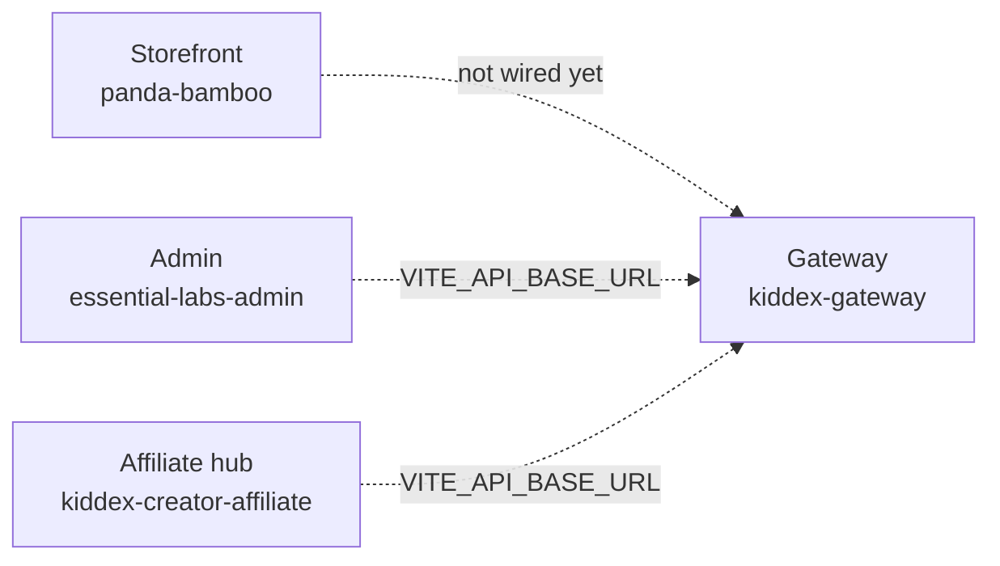

# Kiddex apps — platform overview

Single reference for every app in `kiddex-apps`: what each one does, how it works today, tech stack, ports, auth, and how they fit together.

For the build roadmap and task backlog, see [`plan/README.md`](./plan/README.md).

---

## Platform at a glance

Kiddex is a **multi-app e-commerce platform** aimed at:

| Surface | App folder | Audience | Dev URL |
|---------|------------|----------|---------|
| **Storefront** | `panda-bamboo/` | Shoppers | http://localhost:3000 |
| **Merchant admin** | `kiddex-console/` (`VITE_APP=admin`) | Store operators | http://localhost:5173 |
| **Creator / affiliate hub** | `kiddex-console/` (`VITE_APP=creators`) | Partners (“Trakr”) | http://localhost:5174 |
| **API gateway** | `kiddex-gateway/` | All frontends (future) | http://localhost:4000 |



**Today:** The three frontends run independently. Catalog, orders, and affiliate metrics use **in-app mock/static data**. The gateway is a **stub** (health + placeholder recommendations). Production will route admin and affiliate through the gateway to a shared database and auth service.

**Legacy assets:** The original Kiddex HTML theme also lives at repo root in `Kiddex/` and as static files under `panda-bamboo/public/kiddex/` (images, CSS, fonts). The live storefront UI is implemented as **Next.js React pages**, not those static HTML files.

---

## Workspace root (`kiddex-apps/`)

| Item | Purpose |
|------|---------|
| `package.json` | Dev orchestration only (`concurrently`) — not a shared app bundle |
| `npm run dev` | Starts shop + admin + creators in one terminal |
| `plan/` | Features, architecture, roadmap, [`tasks/TODO.md`](./plan/tasks/TODO.md) |
| `OVERVIEW.md` | This document |

### Prerequisites

- **Node.js** 20+ (LTS recommended)
- **npm** 10+

### Install all apps

```bash
cd kiddex-apps
npm install
npm install --prefix panda-bamboo
npm install --prefix essential-labs-admin
npm install --prefix kiddex-creator-affiliate
# optional:
npm run install:gateway
```

### Run commands

| Command | What runs |
|---------|-----------|
| `npm run dev` | Storefront + admin + affiliate |
| `npm run dev:shop` | Panda Bamboo only |
| `npm run dev:admin` | Essential Labs admin only |
| `npm run dev:creators` | Creator hub only |
| `npm run dev:gateway` | API gateway only |
| `npm run build:shop` / `build:admin` / `build:creators` | Production builds per app |
| `npm run deploy:admin:pages` / `deploy:creators:pages` | Build + deploy admin / affiliate SPAs to Cloudflare Pages (Wrangler) |

---

## 1. Panda Bamboo — customer storefront

**Folder:** `panda-bamboo/`  
**Role:** Public e-commerce site (browse, cart, checkout UI, account, blog, contact).

### Tech stack

| Layer | Technology |
|-------|------------|
| Framework | **Next.js 15** (App Router, Turbopack in dev/build) |
| UI | **React 19**, TypeScript |
| Styling | **Tailwind CSS 4**, custom design system (`design-system/`) |
| Routing | File-based routes under `app/(store)/` |
| E2E | **Playwright** (`e2e/kiddex-pages.spec.ts`) |
| Legacy assets | Static theme in `public/kiddex/` (images, original CSS/JS — reference only) |

### How it works

1. **Home** — `app/(store)/page.tsx` renders `HomePage` (variant 1).
2. **All other store routes** — `app/(store)/[slug]/page.tsx` looks up `slug` in `lib/page-registry.tsx` and renders the matching React view (shop, cart, checkout, login, etc.).
3. **Navigation** — `lib/navigation.ts` defines menus and valid slugs (`storeSlugs`).
4. **Catalog** — `lib/catalog.ts` holds static `products` and `categories` (no API yet). Shop and product-detail pages read this data.
5. **Layout** — `StoreLayout` wraps pages with `SiteHeader`, `SiteFooter`, optional subscribe band.
6. **Design system** — Reusable primitives (`Button`, `ProductCard`, `Section`, tokens in `design-system/tokens.ts`) styled to match the Kiddex theme.
7. **Redirects** — `next.config.ts` redirects old `*.html` URLs (e.g. `/shop.html` → `/shop`) for bookmark compatibility.
8. **Legacy HTML** — Files under `public/kiddex/*.html` are **not** the primary runtime path; React pages are. Assets under `public/kiddex/assets/` supply images and branding paths via `lib/assets.ts`.

### Key routes (React)

| Path | Screen |
|------|--------|
| `/` | Home (variant 1) |
| `/index-2` … `/index-5` | Alternate home layouts |
| `/shop`, `/shop-2` … `/shop-6` | Product listing layouts |
| `/shop-details`, … `-4` | Product detail layouts |
| `/cart`, `/checkout` | Cart & checkout (UI only) |
| `/login`, `/signup`, `/account` | Auth & account (UI only) |
| `/about`, `/contact`, `/search` | Marketing & search |
| `/blog`, `/blog-2`, `/blog-details` | Blog |
| `/error` | Branded 404-style page |

### Auth & data (current)

- **No backend auth** — login/signup are presentational forms.
- **No payment or order API** — checkout is UI mockup.
- **Email** — Legacy `public/kiddex/sendemail.php` (PHP); not integrated with Next.js checkout flow.

### Scripts

| Script | Purpose |
|--------|---------|
| `npm run dev` | `next dev --turbopack` (port 3000) |
| `npm run build` / `start` | Production Next.js |
| `npm run test:e2e` | Playwright tests |
| `npm run sync-kiddex-assets` | Sync assets from source template |

### Deploy

- **Node host:** `npm run build` then `npm run start` (or platform that supports Next.js).
- **Vercel / similar:** Standard Next.js deploy; ensure env for any future `API_BASE_URL`.

---

## 2. Essential Labs Admin — merchant dashboard

**Source:** `essential-labs-admin/src/` (pages, layout, mock data)  
**Build / dev host:** `kiddex-console/` with `VITE_APP=admin`  
**Role:** Internal dashboard for orders, customers, catalog, transactions, and store settings.

### Tech stack

| Layer | Technology |
|-------|------------|
| Build | **Vite 6** |
| UI | **React 19**, **TypeScript** |
| Routing | **React Router 7** (`createBrowserRouter`) |
| Styling | **Tailwind CSS 3**, **Lucide** icons |
| Charts | **Recharts** |
| Output | Static SPA → `dist/` (Netlify, S3, Cloudflare Pages, etc.) |

### How it works

1. **Entry** — `src/main.tsx` mounts `App` with `AuthProvider`.
2. **Auth** — `src/config/staticAuth.ts` defines demo credentials; `sessionStorage` key `essential-labs-admin-session`. `RequireAuth` guards authenticated routes.
3. **Layout** — `AdminLayout` + `Sidebar` for navigation; light/dark theme via `localStorage` (`essential-labs-theme`), applied early from `index.html` to reduce flash.
4. **Data** — `src/data/mockData.ts` feeds dashboard, orders, customers, categories, transactions. **No live API** unless you set `VITE_API_BASE_URL` and implement clients later.
5. **Routing** — Basename-aware (`import.meta.env.BASE_URL`) for subdirectory deploys.

### Routes

| Route | Status |
|-------|--------|
| `/login` | Demo login |
| `/` | Dashboard (KPIs, charts) — mock |
| `/orders` | Order table — mock |
| `/customers` | Customer list + detail — mock |
| `/categories` | Discover + product table — mock |
| `/transactions` | Summary + table — mock |
| `/products/new` | Add product form — UI |
| `/admin-role` | Profile / password UI |
| `/products`, `/products/media`, `/products/reviews` | Placeholders |
| `/coupons`, `/brand`, `/control` | Placeholders |

### Demo login (local only)

| Field | Value |
|-------|-------|
| Email | `admin@essentiallabs.com` |
| Password | `admin123` |

### Environment

| Variable | Purpose |
|----------|---------|
| `VITE_STOREFRONT_URL` | Link out to shop (default `http://localhost:3000`) |
| `VITE_API_BASE_URL` | Future gateway base URL |

### Scripts

| Script | Purpose |
|--------|---------|
| `npm run dev` | Vite dev server (default port **5173**) |
| `npm run build` | `tsc -b && vite build` → `dist/` |
| `npm run preview` | Preview production build |
| `npm run deploy:pages` | Build + `wrangler pages deploy dist` |

### Deploy (Cloudflare Pages)

SPA: `public/_redirects` → `/* /index.html 200`, post-build `404.html`, `wrangler.toml` in app root. Dashboard root: `kiddex-apps/essential-labs-admin`, output `dist`. See app `README.md`.

---

## 3. Kiddex Creator Affiliate — Trakr partner hub

**Source:** `kiddex-creator-affiliate/src/`  
**Build / dev host:** `kiddex-console/` with `VITE_APP=creators`  
**Role:** Affiliate/creator dashboard — marketplace, links, referrals, payouts, reports, settings.

### Admin + Creators: one repo, two deploys

Both dashboards share **`@kiddex/ui`** (`packages/kiddex-ui/`): one Tailwind preset, shared components, and shell-specific accents (green admin / indigo creators via `data-shell` on `<html>`).

| Goal | Command |
|------|---------|
| Dev both | `npm run dev:console` from `kiddex-apps` |
| Build admin only | `npm run build:admin` |
| Build creators only | `npm run build:creators` |
| Cloudflare (admin) | `npm run deploy:admin:pages` |
| Cloudflare (creators) | `npm run deploy:creators:pages` |

Legacy folders `essential-labs-admin/` and `kiddex-creator-affiliate/` forward `npm run dev` / `build` to `kiddex-console`.

### Tech stack

| Layer | Technology |
|-------|------------|
| Build | **Vite 6** |
| UI | **React 19**, **TypeScript** |
| Routing | **React Router 7** |
| Server state | **TanStack Query v5** (`src/hooks/trakrQueries.ts`) |
| Client state | **Zustand** (e.g. sidebar) |
| Styling | **Tailwind CSS 3**, **Lucide**, **Recharts** |
| E2E | **Playwright** |
| Dev port | **5174** (`strictPort` in `vite.config.ts`) |

### How it works

1. **Providers** — `QueryProvider`, `ThemeProvider`, then `AuthProvider` + router.
2. **Auth** — Same pattern as admin: `staticAuth.ts` + `sessionStorage` (`kiddex-creator-affiliate-session`).
3. **Data** — `src/data/trakrDemo.ts` simulates API responses; `trakrQueries` uses artificial `delay()` and React Query cache keys (`trakrKeys`).
4. **Layout** — `AppLayout` with sidebar navigation for Trakr sections.
5. **Influencer mode** — Dedicated route for campaign-focused UX.

### Routes

| Route | Purpose |
|-------|---------|
| `/login` | Demo login |
| `/` | Trakr dashboard (metrics, charts) |
| `/marketplace` | Programs/products to promote |
| `/affiliates`, `/affiliates/:id` | Affiliate directory & detail |
| `/transactions` | Commission / payment ledger |
| `/referrals` | Referral performance |
| `/reports` | Reporting |
| `/payouts` | Payout batches |
| `/settings/campaign` | Campaign defaults |
| `/settings/integrations` | Integrations shell |
| `/settings/email` | Email templates shell |
| `/billing/subscriptions` | Subscription billing shell |
| `/influencer` | Influencer mode |

### Demo login (local only)

| Field | Value |
|-------|-------|
| Email | `creator@kiddexcreators.com` |
| Password | `creator123` |

### Environment

| Variable | Purpose |
|----------|---------|
| `VITE_STOREFRONT_URL` | Shop links |
| `VITE_API_BASE_URL` | Future gateway |

### Scripts

| Script | Purpose |
|--------|---------|
| `npm run dev` | Port 5174 |
| `npm run build` | Static `dist/` |
| `npm run deploy:pages` | Build + Cloudflare Pages deploy |
| `npm run test:e2e` | Playwright (expects dev server on 5174) |

### Deploy (Cloudflare Pages)

SPA with `_redirects` + `404.html`. Dashboard root: `kiddex-apps/kiddex-creator-affiliate`, output `dist`. See `README.md`.

---

## 4. Kiddex Gateway — API / BFF stub

**Folder:** `kiddex-gateway/`  
**Role:** Future **single API entry** for admin and affiliate (and optionally the storefront). Today: health checks and a recommendations placeholder.

### Tech stack

| Layer | Technology |
|-------|------------|
| Runtime | **Node.js** (ES modules) |
| HTTP | **Express 4** |
| Middleware | **cors**, `express.json()` |
| Dev | `node --watch src/server.mjs` |

### How it works

- Listens on `PORT` (default **4000**).
- **No database**, **no JWT** yet — readiness returns `database: "skipped"`.
- Unknown routes → `404` JSON `{ error: "not_found" }`.

### Endpoints (today)

| Method | Path | Response |
|--------|------|----------|
| `GET` | `/health` | `{ ok, service, ts }` |
| `GET` | `/v1/ready` | `{ ready, checks }` stub |
| `GET` | `/v1/recommendations?productId=` | Empty stub `ids: []` |

### Planned evolution

- JWT validation, `/v1/products`, `/v1/orders`, `/v1/affiliates`, webhooks.
- Admin and creator apps point `VITE_API_BASE_URL` here.
- See [`kiddex-gateway/README.md`](./kiddex-gateway/README.md) and [`plan/architecture.md`](./plan/architecture.md).

### Scripts

```bash
cd kiddex-gateway && npm install && npm run dev
```

---

## Cross-app comparison

| | Storefront | Admin | Affiliate | Gateway |
|---|------------|-------|-----------|---------|
| **Framework** | Next.js 15 | Vite 6 SPA | Vite 6 SPA | Express |
| **React** | 19 | 19 | 19 | — |
| **Router** | App Router | React Router 7 | React Router 7 | — |
| **Tailwind** | v4 | v3 | v3 | — |
| **Auth** | UI only | Static demo | Static demo | None |
| **Data** | `lib/catalog.ts` | `mockData.ts` | `trakrDemo.ts` + React Query | Stub JSON |
| **Default port** | 3000 | 5173 | 5174 | 4000 |
| **Deploy target** | Node / Vercel | Static `dist/` | Static `dist/` | Node service |

---

## Integration status

| Capability | Storefront | Admin | Affiliate | Gateway |
|------------|------------|-------|-----------|---------|
| Shared product DB | — | — | — | — |
| Real authentication | — | — | — | — |
| Checkout / payments | UI only | — | — | — |
| Order sync | — | Mock | — | — |
| Affiliate tracking | — | — | Mock | — |
| Recommendations API | — | — | — | Stub |

**Target flow (from plan):** Gateway + PostgreSQL → admin writes catalog → shop reads catalog → checkout creates orders → affiliate cookie + commission on paid orders → Trakr shows payouts.

---

## Related repo paths (outside `kiddex-apps`)

| Path | Notes |
|------|-------|
| `Kiddex/` | Original HTML theme source; reference for content and assets |
| `Kiddex/sendemail.php` | Legacy PHP mail helper |
| `ninjahire/` | Separate project (Supabase) — not part of Kiddex apps workspace |

---

## Security note

Demo passwords in `staticAuth.ts` are **for local UI only**. Remove or replace before any public deploy; use the gateway + proper identity provider in production.

---

## Further reading

| Document | Content |
|----------|---------|
| [`README.md`](./README.md) | Quick start, env vars, per-app README links |
| [`plan/features.md`](./plan/features.md) | Full feature list by domain |
| [`plan/architecture.md`](./plan/architecture.md) | Target APIs, DB, attribution |
| [`plan/roadmap.md`](./plan/roadmap.md) | Phased delivery |
| [`plan/tasks/TODO.md`](./plan/tasks/TODO.md) | Checkable implementation tasks |
| [`essential-labs-admin/README.md`](./essential-labs-admin/README.md) | Admin-specific notes |
| [`kiddex-gateway/README.md`](./kiddex-gateway/README.md) | Gateway next steps |

---

*Last aligned with repo structure: storefront on Next.js React pages, three SPAs + gateway stub, mock data in admin and affiliate.*
