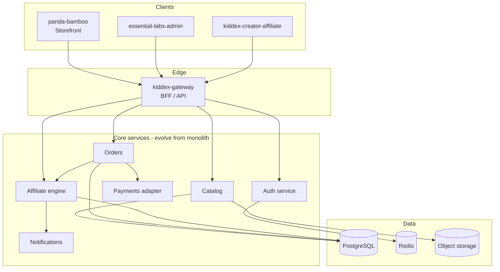

# Architecture (target)

High-level design for connecting the four apps into one coherent platform.

## System context



## Recommended API surface (gateway)

| Domain | Example routes | Consumers |
|--------|------------------|-----------|
| Auth | `POST /v1/auth/login`, `POST /v1/auth/refresh`, `GET /v1/me` | All |
| Catalog | `GET /v1/products`, `GET /v1/products/:id`, admin `POST/PATCH/DELETE` | Shop, Admin |
| Cart | `GET/POST /v1/cart` (or client-side + checkout only) | Shop |
| Orders | `POST /v1/checkout`, `GET /v1/orders`, `PATCH /v1/orders/:id/status` | Shop, Admin |
| Customers | `GET /v1/customers`, admin notes | Admin |
| Affiliates | `GET /v1/affiliates`, links, `GET /v1/commissions` | Aff, Admin |
| Tracking | `GET /r/:code` redirect, `POST /v1/attribution` | Shop, Aff |
| Payouts | `GET /v1/payouts`, `POST /v1/payouts/run` | Aff, Admin |
| Webhooks | `POST /v1/webhooks/stripe` | Pay provider |

## Core entities (PostgreSQL)

- `users` — base identity (email, password hash, role flags).
- `customers`, `admin_users`, `affiliates` — role-specific profiles linked to `users`.
- `products`, `product_variants`, `categories`, `product_images`.
- `inventory_levels` — per variant, warehouse optional.
- `carts`, `cart_items` — optional if server-side cart.
- `orders`, `order_items`, `order_status_history`.
- `payments`, `refunds`.
- `coupons`, `coupon_redemptions`.
- `affiliate_links`, `clicks`, `commissions`, `payouts`.
- `audit_logs`, `webhook_deliveries`.

## Auth model

| App | Token | Notes |
|-----|-------|-------|
| Storefront | HttpOnly cookie or short-lived JWT in memory | Customer scope |
| Admin | Bearer JWT, `role: admin` | Stricter CORS; IP allowlist optional |
| Affiliate | Bearer JWT, `role: affiliate` | Own data only unless agency features |

Replace `staticAuth.ts` in both Vite apps with login → gateway → store token → `Authorization` header on API client.

## Storefront integration options

1. **Phase A (fast):** Keep static HTML; add small JS bundle that fetches JSON from gateway and hydrates product grids / cart IDs.
2. **Phase B (SEO):** Next.js App Router pages for `/shop/[slug]` with ISR; static marketing pages remain in `public/kiddex/`.
3. **Phase C:** Full React checkout embedded in Next while preserving Kiddex design tokens.

## Affiliate attribution flow

1. User hits `https://shop.example/r/{affiliateCode}?redirect=/product/...`
2. Gateway sets attribution cookie (e.g. 30-day window), redirects to storefront.
3. Checkout payload includes `attributionId` from cookie.
4. On `order.paid`, affiliate engine creates `commission` row (pending → approved after return window).
5. Admin or cron runs payout batch; affiliate hub shows ledger.

## Environments

| Env | Purpose |
|-----|---------|
| `local` | Docker Compose: Postgres, Redis, gateway, three frontends |
| `staging` | Full integration + test payment keys |
| `production` | CDN for shop, separate admin/aff subdomains |

## Repo layout (suggested evolution)

```
kiddex-apps/
  plan/                 ← you are here
  panda-bamboo/
  essential-labs-admin/
  kiddex-creator-affiliate/
  kiddex-gateway/         ← grow into BFF or split kiddex-api/
  packages/             ← optional shared types, eslint, UI tokens
    shared-types/
```

## Non-functional targets

| Concern | Target |
|---------|--------|
| Availability | 99.9% for checkout path |
| Latency | p95 &lt; 300ms API reads; checkout &lt; 2s |
| Scale | Horizontal gateway + stateless workers; read replicas later |
| Backups | Daily DB snapshots; PITR in production |
